  
  &nbsp;
  
  &nbsp;
  
  &nbsp;
  

## Mission log

I'm Hudson, a full-stack developer from São José dos Campos — Brazil's
aerospace city, which may explain the theme.

I got here in 2021 through Resilia's web development course, building my
first pages in HTML, CSS and JavaScript. The orbit has widened since: REST
APIs in PHP with Laravel and Slim, services in Node.js, bots in Python, and
now a React Native app with a FastAPI and PostgreSQL back end.

I like software that survives real life: offline-first, safe to retry, tested
before it is written. Lately I build spec-first with AI agents. I decide what
the product should do; one agent writes and reviews the spec, another
implements it test-first, and every review is public in the repository.

At home there are four cats and a dog: Aurora, Asteria, Aelin, Andrômeda and
Katarina. The space theme was never really a choice.

> Change starts with you. It starts with me. It starts with all of us.

## Home system: Insurge

[Insurge](https://insurge.pages.dev/) is the software studio I am helping get
off the ground: custom systems, integrations, mobile apps and AI agents for
businesses that have outgrown off-the-shelf software. Its own products live in
**Orbyta**, a system of seven planets around a black hole. Each planet runs one
part of an operation, each moon is one of its modules, and all of it is still
under construction.

What leaves the studio will carry a small **by Insurge** mark.

## The stack, as a constellation

The same sky, as text

 

- **Languages:** TypeScript, JavaScript, Python, PHP
- **Front end and mobile:** React, React Native, Expo, HTML and CSS
- **Back end:** FastAPI, Node.js, Laravel, Slim
- **Data and tooling:** PostgreSQL, MySQL, Redis, SQLite, Docker, Git

## Flight telemetry

Public activity only, read from the GitHub API and redrawn every hour by
<a href=".github/workflows/telemetry.yml">a workflow in this repository</a>.
The grade uses the formula of the
<a href="https://github.com/anuraghazra/github-readme-stats">github-readme-stats</a>
card.

## Projects in orbit

Six worlds worth a visit. Click one to land on its repository.

<table>
  <tr>
    <td width="50%" align="center" valign="top">
      
      <h3><a href="https://github.com/hudson-uchoa/pawlaris">Pawlaris</a></h3>
      Self-hosted, offline-first pet care for a household: tasks, medication, walks and who did what. Built in the open, spec first.
        
      TypeScript · React Native · Python · FastAPI · PostgreSQL
    </td>
    <td width="50%" align="center" valign="top">
      
      <h3><a href="https://github.com/hudson-uchoa/ByteWatch">ByteWatch</a></h3>
      A Discord bot that tracks coding and study sessions, projects, and how much of the work leaned on AI assistants, with a weekly ranking.
        
      Python · SQLite · Discord
    </td>
  </tr>
  <tr>
    <td width="50%" align="center" valign="top">
      
      <h3><a href="https://github.com/hudson-uchoa/TaskMate">TaskMate</a></h3>
      A to-do app with accounts, full task management and status counters, shipped as a Docker Compose stack.
        
      PHP · Slim · React · PostgreSQL · Redis · Docker
    </td>
    <td width="50%" align="center" valign="top">
      
      <h3><a href="https://github.com/hudson-uchoa/multi-contact-management">Multi Contact Management</a></h3>
      People and their contacts, with authentication, soft deletes, statistics by country and a countries API.
        
      PHP · Laravel · MariaDB · Bootstrap
    </td>
  </tr>
  <tr>
    <td width="50%" align="center" valign="top">
      
      <h3><a href="https://github.com/hudson-uchoa/magic_api">Magic API</a></h3>
      A JWT-protected REST API for Magic: The Gathering sets and cards, object-oriented and nearly framework-free, with a cached public listing.
        
      PHP · Slim · MySQL
    </td>
    <td width="50%" align="center" valign="top">
      
      <h3><a href="https://github.com/hudson-uchoa/API-Rest-Transportadora">API Transportadora</a></h3>
      A REST API for a freight carrier, built as the closing project of the fourth module at Resilia.
        
      JavaScript · Node.js · Express · SQLite
    </td>
  </tr>
</table>

  

## Open a channel

The quickest way to reach me is
[LinkedIn](https://www.linkedin.com/in/hudson-uchoa/). Questions about a
repository are welcome in its issues, and a star on anything you found useful
keeps the lights on up here.

No GIFs were harmed in the making of this page: every animation is an SVG
drawn by <a href="scripts/build-assets.mjs"><code>scripts/build-assets.mjs</code></a>,
and each one holds still if your system asks for reduced motion.
